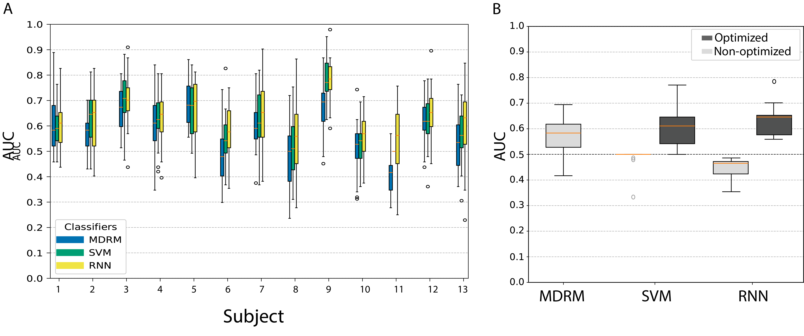
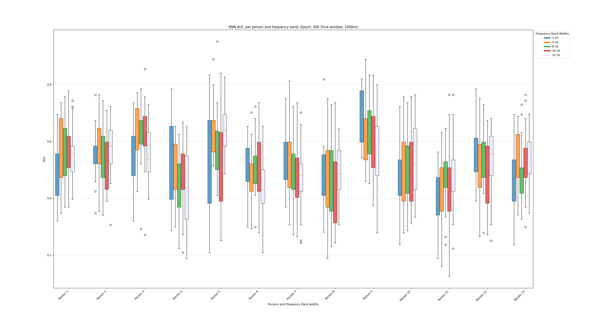

# Classification-of-same-hand-motor-imagery-using-Riemannian-Geometry-and-Recurrent-Neural-Network
This project presents a novel hybrid approach for Electroencephalography (EEG)-based Motor Imagery (MI) classification focusing on distinguishing same-hand movements (e.g., left-hand clench vs. left-hand wrist extension). The method leverages Riemannian Geometry to robustly extract spatial features (covariance matrices) from the EEG signals, addressing the non-Euclidean nature of brain signal data. These robust features are then fed into a Recurrent Neural Network (RNN), specifically LSTM (Long short-term memory), to effectively model the temporal dynamics inherent in the MI task. The primary objective is to enhance classification accuracy and robustness, particularly for the challenging task of discriminating subtle variations within a single limb's motor intent.


## 🛠️ Dependency Setup

To run this project locally, you will need Python 3.12.9+ and pip.

1.  **Clone the Repository**
    ```bash
    git clone [https://github.com/Jacob-Johansson/Classification-of-same-hand-motor-imagery-using-Riemannian-Geometry-and-Recurrent-Neural-Network.git)
    cd your-repo
    ```
2.  **Install Dependencies**
    Using a virtual environment:
    ```bash
    python -m venv venv
    source venv/bin/activate  # On Windows, use: venv\Scripts\activate
    pip install -r requirements.txt
    ```

The complete text of the paper can be accessed here until the it's published officially:
[Hand_MI_classification_using_Riemannian_Geometry_RNN](assets/Hand_MI_classification_using_Riemannian_Geometry_RNN.pdf)


This figure, composed of two panels, displays the performance comparison of three classification models ($\text{MDRM}$, $\text{SVM}$, and $\text{RNN}$) using the Area Under the Curve ($\text{AUC}$) metric.Panel A (Classifier Performance by Subject): This panel shows the distribution of $\text{AUC}$ values for the three classifiers across 13 different experimental subjects. For each subject, the data represents the performance achieved using the most optimal frequency bandwidth determined for that specific individual. The box plots summarize the central tendency and variability of the $\text{AUC}$ scores for each classifier-subject combination.Panel B (Optimization Comparison): This panel directly compares the impact of optimization on the $\text{AUC}$ performance of the three classifiers. For each model ($\text{MDRM}$, $\text{SVM}$, $\text{RNN}$), the dark gray box plot represents the distribution of $\text{AUC}$ scores after optimization, while the light gray box plot represents the performance before optimization (Non-optimized).


This figure presents a detailed multi-variate box plot analysis of the Recurrent Neural Network ($\text{RNN}$) model's performance, measured by the $\text{AUC}$ metric. The analysis explores the effects of different frequency bandwidths on $\text{RNN}$ performance across all subjects.The results are grouped by individual subject (labeled Person 1 through Person 13).For each subject, five distinct box plots compare the $\text{AUC}$ distribution across different frequency band widths (e.g., 2 Hz, 4 Hz, 8 Hz, 16 Hz, 32 Hz).The $\text{RNN}$ model was trained for 300 epochs and with a fixed 1000ms time window. This visualization helps identify which frequency bandwidths yield the most robust $\text{AUC}$ scores for the $\text{RNN}$ model.
